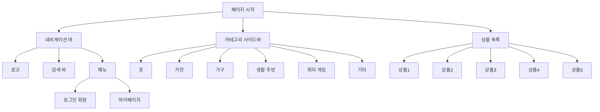

```mermaid
flowchart TD

    A[페이지 시작] --> B[네비게이션 바]
    B --> C[로고]
    B --> D[검색 바]
    B --> E[메뉴]
    E --> E1[로그인 회원]
    E --> E2[마이페이지]

    A --> F[카테고리 사이드바]
    F --> F1[옷]
    F --> F2[가전]
    F --> F3[가구]
    F --> F4[생활 주방]
    F --> F5[취미 게임]
    F --> F6[기타]

    A --> G[상품 목록]
    G --> G1[상품1]
    G --> G2[상품2]
    G --> G3[상품3]
    G --> G4[상품4]
    G --> G5[상품5]
```
